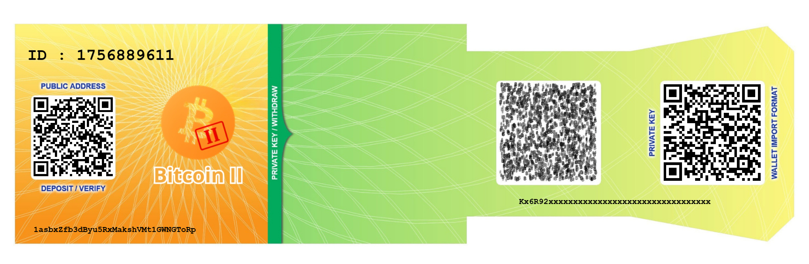

# BitcoinII Paper Wallet Generator

🔐 **Paper Wallet Generator untuk BitcoinII (dan Bitcoin)**  
Buat dompet kertas (paper wallet) secara **offline**, aman, dan siap cetak — dengan fitur otomatisasi, QR code, dan ID unik berbasis waktu.

 *(Opsional: tambahkan screenshot jika ada)*

---

## 📌 Fitur Utama

- ✅ **Offline sepenuhnya** – Aman dari serangan online
- 🧩 **Modular JavaScript** – Mudah dikembangkan dan dipelihara
- 🖨️ **Siap cetak (A4)** – Tampilan rapi, bisa disimpan sebagai PDF
- 🔢 **ID Otomatis** – Setiap wallet diberi ID unik berbasis waktu (contoh: `ID: 20250405-143022`)
- 🏷️ **Dukungan Multi-Tipe Alamat**:
  - P2PKH (1...)
  - P2SH-P2WPKH (3...)
  - Bech32 (bc1...)
- 🖼️ **QR Code Publik & Privat**
- 🛠️ **Kustomisasi posisi QR & teks** via input form
- 💾 **Tanpa koneksi server** – Semua proses di sisi klien

---

## 🚀 Cara Menggunakan

### 1. Unduh Proyek
```bash
git clone https://github.com/tempatbloger/BitcoinII-Paper-Wallet.git
cd bitcoinii-paper-wallet
```


- Donations bc2: ``` 1asbxZfb3dByu5RxMakshVMt1GWNGToRp```
